<div align="center">

# 🤖 AI Web Automation Agent

[](https://www.python.org/downloads/)
[](LICENSE)
[](https://ai.google.dev/)
[](https://pytorch.org/)
[](https://playwright.dev/)

**A sophisticated multi-agent web automation system powered by Google Gemini 2.5 Pro**

Featuring visual perception via OmniParser, intelligent task planning, and autonomous self-supervised execution.

[Features](#features) • [Installation](#installation) • [Quick Start](#quick-start) • [Architecture](#architecture) • [Documentation](README_ARCHITECTURE.md)

</div>

---

## ✨ Features

### Core Capabilities

| Feature | Description |
|---------|-------------|
| 🏗️ **Multi-Agent Architecture** | Hierarchical system with Master orchestrator, Supervisor monitors, and Worker executors for scalable automation |
| 👁️ **Visual Perception** | OmniParser (Qwen2-VL + EasyOCR) enables accurate element detection without brittle DOM selectors |
| 🧠 **AI-Driven Planning** | Gemini 2.5 Pro decomposes complex goals into executable TaskDAGs with dependency management |
| ✅ **Self-Verification** | Agents verify task completion with confidence scoring and request replanning when needed |
| 🔄 **Adaptive Replanning** | Automatic recovery from failures with AI-driven RETRY/SKIP/REPLAN decisions |
| 💾 **Persistent Memory** | Shared AccomplishmentStore prevents redundant work across parallel workers |
| 🔒 **Type Safety** | LangChain + Pydantic structured outputs eliminate JSON parsing errors |
| ⚡ **Performance** | 80%+ cache hit rate, parallel execution, and smart resource management |

## Table of Contents

- [Architecture](#architecture)
- [System Requirements](#system-requirements)
- [Installation](#installation)
- [Quick Start](#quick-start)
- [Configuration](#configuration)
- [Usage Examples](#usage-examples)
- [Project Structure](#project-structure)
- [How It Works](#how-it-works)
- [Troubleshooting](#troubleshooting)
- [License](#license)

## Architecture

> **For detailed architecture documentation, see [README_ARCHITECTURE.md](README_ARCHITECTURE.md)**

### System Overview

The system follows a **3-tier hierarchical multi-agent architecture**:


### Execution Flow


### Key Components

**1. MasterAgent** (Singleton)
- **Purpose**: Top-level orchestrator coordinating entire session
- **Flow**: Navigate → Plan → DAG → Supervise → Verify → Loop
- **Shared Resources**: Single GeminiAgent, ScreenParser, Browser, Redis store
- **Memory**: Aggressive cleanup (CUDA cache, GC, singleton reset)

**2. AISupervisorAgent** (Per-DAG)
- **Purpose**: Monitors task execution & recovers from failures
- **Loop**: Health check → Ready tasks → Spawn workers → Handle results
- **AI Decisions**: RETRY (reset task), SKIP (unblock deps), REPLAN (add recovery), ABORT (exit)
- **Protection**: 30s cooldown, max 3 consecutive skips, worker requests bypass

**3. WorkerAgent** (Per-Task)
- **Purpose**: Executes single task with observe-decide-act loop
- **Feasibility**: Detects task-screen mismatches → requests replan
- **Thread ID**: `worker_worker_{task_id}_sup{N}_{uuid}` (isolation)
- **Limits**: Max 50 iterations per task

**4. ActionLoop** (Worker Core)
- **OBSERVE**: Screenshot → OmniParser (cached) → DOM enrichment
- **DECIDE**: Gemini structured output → tool call (click/type/etc)
- **ACT**: ActionHandler executes with delays (prevents mis-clicks)

**5. Supporting Systems**

- **ScreenParser**: OmniParser wrapper with SQLite cache (80%+ hit rate)
- **GeminiAgent**: gemini-2.5-pro with structured outputs (planning, actions, decisions, verification)
- **ConversationManager**: Conversation storage with Redis + in-memory fallback
- **AccomplishmentStore**: Session-scoped shared cache (work deduplication)
- **DecisionEngine**: AI-driven recovery & continuation decisions
- **HealthMonitor**: Tracks success rate, detects deadlocks, stuck situations

### Design Principles

1. **Separation of Concerns**: Master orchestrates, Supervisor monitors, Worker executes
2. **Resource Sharing**: Single expensive resources (OmniParser, Gemini, Browser)
3. **Context Isolation**: Unique thread_ids prevent Gemini pollution, enable parallelism
4. **AI-Driven Recovery**: No hardcoded rules - AI analyzes failures & decides actions
5. **Memory Efficiency**: Aggressive caching, cleanup, immediate object deletion
6. **Type Safety**: Pydantic models + LangChain structured outputs (no JSON parsing)

### Performance

**Resource Usage** (with GPU):
- RAM: ~6-8 GB (OmniParser + Qwen2-VL + Browser)
- VRAM: ~4-6 GB (Vision models)
- Latency: 1-2s per action (cache hit), 4-6s (cache miss)

**Optimizations**:
- Screen caching: 80%+ hit rate → 3-4x speedup
- Accomplishment sharing: 30-50% fewer redundant actions
- Parallel execution: Up to 4x workers → 2-3x speedup
- Early feasibility: Saves 5-10 wasted iterations per mismatch

## System Requirements

### Hardware Requirements

| Component | Minimum | Recommended |
|-----------|---------|-------------|
| **RAM** | 8 GB | 16+ GB |
| **GPU** | None (CPU inference) | NVIDIA GPU with 6GB+ VRAM for faster OmniParser |
| **Storage** | 8+ GB free space | 16+ GB free space |

## 📦 Installation

> **Note**: Tested on Python 3.9-3.13 • Linux, macOS, and Windows (WSL2)

### 1. Clone the Repository

```bash
git clone https://github.com/spoloxs/automata.git
cd automata/web-agent
```

**Repository**: [https://github.com/spoloxs/automata](https://github.com/spoloxs/automata)

### 2. Create a Virtual Environment

It's recommended to use a virtual environment to avoid dependency conflicts.

```bash
python3 -m venv venv
source venv/bin/activate  # On Windows: venv\Scripts\activate
```

### 3. Install Dependencies

```bash
pip install --upgrade pip
pip install -r requirements.txt
```

### 4. Install Playwright Browsers

```bash
playwright install chromium
```

### 5. Setup OmniParser Weights

**IMPORTANT**: This project includes a **customized OmniParser** implementation in the `OmniParser/` directory. Do **NOT** use the original Microsoft OmniParser repository - always use the included version which has been optimized for this project.

Download the required pre-trained model weights:

```bash
# Download weights to the included OmniParser directory
cd OmniParser/weights

# Download icon detection model
wget https://huggingface.co/microsoft/OmniParser/resolve/main/icon_detect/model.safetensors -P icon_detect/

# Download caption model (choose one based on your preference if not using Qwen or EasyOCR for OCR):
# Option 1: Florence (recommended for better accuracy)
wget https://huggingface.co/microsoft/OmniParser/resolve/main/icon_caption_florence/model.safetensors -P icon_caption_florence/

# Option 2: BLIP2 (lighter alternative)
wget https://huggingface.co/microsoft/OmniParser/resolve/main/icon_caption_blip2/model.safetensors -P icon_caption_blip2/
```

**Required files structure:**
```
OmniParser/weights/
├── icon_detect/
│   └── model.safetensors
└── icon_caption_florence/  (or icon_caption_blip2/)
    └── model.safetensors
```

### 6. Configure Environment

```bash
cp .env.example .env
```

Edit `.env` and add your **Gemini API key**:

```env
GEMINI_API_KEY=your_gemini_api_key_here
```

**Note**: Some environment variables are still being migrated to use `.env` configuration. Most settings can be found in [src/web_agent/config/settings.py](src/web_agent/config/settings.py).

**Get Gemini API Key**: https://aistudio.google.com/app/apikey

### 7. Install and Start Redis

Redis is used for persistent conversation storage and caching:

**Ubuntu/Debian:**
```bash
sudo apt-get install redis-server
sudo systemctl start redis-server
sudo systemctl enable redis-server
```

**macOS:**
```bash
brew install redis
brew services start redis
```

**Windows (WSL2):**
```bash
sudo apt-get install redis-server
sudo service redis-server start
```

**Verify Redis is running:**
```bash
redis-cli ping  # Should return "PONG"
```

### 8. Verify Installation

```bash
python -c "import torch; print(f'PyTorch: {torch.__version__}')"
python -c "from playwright.async_api import async_playwright; print('Playwright OK')"
python -c "import redis; print(f'Redis: {redis.__version__}')"
python scripts/verify_setup.py
```

## Quick Start

### 🎨 Web GUI (Recommended)

The easiest and most user-friendly way to use the agent:

```bash
# Start the web interface
python app.py

# Or use the startup script
./start_gui.sh
```

Then open your browser to **http://localhost:7860**

**Features:**
- 📎 **Upload Documents**: Drag & drop PDFs (resumes, forms, etc.)
- 🤖 **AI-Powered**: Gemini uses your documents to fill forms automatically
- 📊 **Real-time Progress**: Watch the automation happen live
- 💡 **Examples**: Pre-loaded examples to get started quickly

**Example Use Case:**
1. Upload your resume (PDF)
2. Enter URL: `https://company.com/careers/apply`
3. Task: `Fill the job application using my resume`
4. Click "Run Automation" ✨

### 🚀 Interactive CLI

For command-line enthusiasts:

```bash
# Run the CLI tool
python cli.py

# Or use the wrapper script
./automate
```

The CLI will prompt you for:
- **Target URL**: The website to automate (e.g., `https://www.google.com`)
- **Task**: What you want to accomplish (e.g., `Search for 'Python' and click first result`)
- **Workers**: Number of parallel workers (default: 2)

**Example session:**
```
╔═══════════════════════════════════════════════════════════╗
║                                                           ║
║        🤖 AI Web Automation Agent CLI v0.1.0             ║
║                                                           ║
║        Powered by Gemini 2.5 Pro + OmniParser            ║
║                                                           ║
╚═══════════════════════════════════════════════════════════╝

Enter automation details:

Target URL: https://www.google.com
Task: Search for 'Python asyncio tutorial' and click first result
Max parallel workers [2]: 2

✓ Automation completed successfully! ✨
```

### 💻 Command Line Arguments

For automation scripts or CI/CD:

```bash
# Direct execution with arguments
python cli.py --url "https://www.google.com" \
              --task "Search for 'Python' and click first result"

# With custom settings
python cli.py --url "https://example.com" \
              --task "Fill contact form" \
              --workers 4 \
              --headless

# Show help
python cli.py --help
```

**CLI Options:**
| Option | Short | Description | Default |
|--------|-------|-------------|---------|
| `--url` | `-u` | Target URL to automate | Interactive prompt |
| `--task` | `-t` | Task description | Interactive prompt |
| `--workers` | `-w` | Max parallel workers | 2 |
| `--headless` | - | Run browser in headless mode | Visible |
| `--version` | `-v` | Show version | - |
| `--help` | `-h` | Show help message | - |

### 🐍 Python API

For integration into your own scripts:

```python
import asyncio
from web_agent.core.master_agent import MasterAgent

async def main():
    # Initialize the master agent
    master = MasterAgent(max_parallel_workers=2)
    await master.initialize()

    try:
        # Execute the automation goal
        result = await master.execute_goal(
            goal="Search for 'Python asyncio tutorial' and click the first result",
            starting_url="https://www.google.com"
        )

        # Check results
        print(f"Success: {result.success}")
        print(f"Tasks completed: {result.completed_tasks}/{result.total_tasks}")
    finally:
        # Always cleanup resources
        await master.cleanup()

if __name__ == "__main__":
    asyncio.run(main())
```

### 📚 Example Scripts

```bash
# Simple search example
python examples/simple_search.py

# Form filling
python examples/form_filling.py

# Data extraction
python examples/data_extraction.py

# Interactive mode
python main.py
```

## Configuration

### Environment Variables (.env)

```env
# Gemini API
GEMINI_API_KEY=your_key_here
# Model is hardcoded to gemini-2.5-pro in gemini_agent.py

# Browser Settings
BROWSER_HEADLESS=false
BROWSER_TIMEOUT=30000  # milliseconds
BROWSER_WINDOW_SIZE=1440,900

# Agent Limits
MAX_WORKER_DEPTH=3
WORKER_TOKEN_LIMIT=100000
MAX_ACTION_ITERATIONS=50

# Memory & Caching
ENABLE_SCREEN_CACHE=true
CACHE_TTL_SECONDS=3600
ENABLE_ACCOMPLISHMENT_STORE=true

# Logging
LOG_LEVEL=INFO  # DEBUG, INFO, WARN, ERROR
```

### Settings (config/settings.py)

Key configuration options:

```python
# Vision Model Settings
OMNIPARSER_DEVICE = "cuda"  # or "cpu"
OMNIPARSER_BATCH_SIZE = 8

# LLM Settings
GEMINI_TEMPERATURE = 0.7
GEMINI_MAX_TOKENS = 8192

# Supervisor Settings
REPLAN_COOLDOWN_SECONDS = 30
MAX_CONSECUTIVE_SKIPS = 3
SUPERVISION_INTERVAL = 2.0  # seconds

# Worker Settings
ACTION_DELAY_BEFORE = 0.3  # seconds before click/type
ACTION_DELAY_AFTER = 0.7   # seconds after click/type
```

## Usage Examples

### Example 1: Web Search & Click

```python
result = await master.execute_goal(
    goal="Search for 'machine learning' on Google and click the Wikipedia result",
    starting_url="https://www.google.com"
)
```

### Example 2: Form Filling

```python
result = await master.execute_goal(
    goal="Fill out the contact form with name 'John Doe' and email 'john@example.com', then submit",
    starting_url="https://example.com/contact"
)
```

### Example 3: Data Extraction

```python
result = await master.execute_goal(
    goal="Extract the top 5 news headlines from the homepage",
    starting_url="https://news.ycombinator.com"
)

# Access extracted data
if result.success:
    print(result.extracted_data)
```

### Example 4: Multi-Step Workflow

```python
result = await master.execute_goal(
    goal="""
    1. Go to GitHub
    2. Search for 'web automation'
    3. Click on the first repository
    4. Star the repository
    5. Navigate to the Issues tab
    """,
    starting_url="https://github.com"
)
```

## Project Structure

```
web-agent/
├── config/                  # Configuration
│   └── settings.py          # Global settings
├── src/web_agent/           # Main source code
│   ├── core/                # Core agents
│   │   ├── master_agent.py      # Orchestrator
│   │   ├── supervisor_agent.py  # Task monitor
│   │   └── worker_agent.py      # Task executor
│   ├── planning/            # Task planning
│   │   ├── planner.py           # Goal decomposition
│   │   └── dag_converter.py     # Plan to DAG
│   ├── scheduling/          # Worker management
│   │   └── scheduler.py         # Worker pool
│   ├── execution/           # Action execution
│   │   ├── action_loop.py       # Observe-decide-act
│   │   ├── action_handler.py    # Action execution
│   │   └── browser_controller.py # Playwright wrapper
│   ├── perception/          # Visual perception
│   │   ├── screen_parser.py     # OmniParser integration
│   │   ├── omniparser_wrapper.py
│   │   └── element_formatter.py
│   ├── intelligence/        # LLM integration
│   │   ├── gemini_agent.py      # Gemini wrapper
│   │   ├── prompt_builder.py    # Prompt generation
│   │   └── tool_definitions.py  # Action schemas
│   ├── verification/        # Task verification
│   │   └── verifier.py          # Completion checking
│   ├── supervision/         # Health monitoring
│   │   ├── health_monitor.py    # Health tracking
│   │   └── decision_engine.py   # AI recovery
│   └── storage/             # Memory & caching
│       ├── screen_cache.py      # Screenshot cache
│       ├── accomplishment_store.py
│       └── worker_memory.py
├── OmniParser/              # Vision model (submodule)
├── examples/                # Usage examples
├── tests/                   # Unit & integration tests
├── scripts/                 # Utility scripts
├── .env.example             # Example environment file
├── requirements.txt         # Python dependencies
├── pyproject.toml           # Project metadata
└── README.md                # This file
```

## How It Works

### Worker Action Loop (Observe-Decide-Act)


### Key Design Principles

```mermaid
mindmap
  root((Web Agent<br/>Design))
    Separation of Concerns
      Master → Orchestration
      Supervisor → Monitoring
      Worker → Execution
    Context Isolation
      Unique thread_id per worker
      Prevents pollution
      Enables parallelism
    Token Management
      Disposable workers
      Persistent master
      Structured outputs
    AI-Driven Recovery
      Failure analysis
      Auto retry/skip/replan
      Health monitoring
    Visual-First
      OmniParser detection
      DOM enrichment
      Shadow DOM support
    Performance
      Screen caching 80%+
      Parallel workers 4x
      Shared accomplishments
```



## Troubleshooting

### Common Issues

**Issue: "OmniParser weights not found"**
```bash
# Download weights manually
cd OmniParser/weights
wget https://huggingface.co/microsoft/OmniParser/resolve/main/icon_detect/model.safetensors
```

**Issue: "Gemini API rate limit exceeded"**
- Wait 60 seconds between retries
- Reduce `max_parallel_workers` in MasterAgent
- Check API quota: https://aistudio.google.com/app/apikey

**Issue: "Browser timeout"**
- Increase `BROWSER_TIMEOUT` in .env
- Check internet connection
- Try headless mode: `BROWSER_HEADLESS=true`

**Issue: "CUDA out of memory"**
```python
# Use CPU for OmniParser
OMNIPARSER_DEVICE = "cpu"  # in config/settings.py
```

**Issue: "Worker stuck in infinite loop"**
- Check logs for "max iterations reached"
- Supervisor will auto-replan after cooldown
- Reduce `MAX_ACTION_ITERATIONS` if needed

### Debug Mode

Enable detailed logging:

```bash
export LOG_LEVEL=DEBUG
python main.py
```

Or in code:

```python
import logging
logging.basicConfig(level=logging.DEBUG)
```

### Performance Tips

1. **Enable GPU acceleration** (if available)
   ```python
   OMNIPARSER_DEVICE = "cuda"
   ```

2. **Use screen caching**
   ```python
   ENABLE_SCREEN_CACHE = True
   ```

3. **Reduce parallel workers** (if memory constrained)
   ```python
   master = MasterAgent(max_parallel_workers=1)
   ```

4. **Use headless mode** (faster)
   ```bash
   BROWSER_HEADLESS=true
   ```

## 🚧 Roadmap & Work in Progress

> **Current Version**: 0.1.0 (Alpha) • **Last Updated**: December 2024

The following improvements are currently under development:

### Performance Optimizations
- **Faster execution** - Optimizing action delays and caching strategies
- **Reduced latency** - Streamlining observe-decide-act cycle
- **Better resource usage** - Memory management improvements

### iframe Support(It's able to detect and solve them but still needs some improvemens)
- **Cross-origin iframe handling** - Working on seamless iframe context switching
- **Complex nested iframes** - Support for deeply nested iframe structures
- **Crossword puzzles** - Specialized handling for iframe-based games and puzzles

### Vision System Improvements
- **Optimizing visual analysis** - Currently, when OmniParser can't detect elements, the system falls back to Gemini Vision API (sends full screenshots). Future improvements include:
  - Better OmniParser tuning and configuration
  - Enhanced DOM-based fallback strategies
  - Hybrid detection methods to reduce API calls
  - Improved element detection for complex UIs

### Planned Features


**Upcoming Enhancements**:
- 🔧 Enhanced error recovery with smarter retry logic
- 📱 Better handling of dynamic content and lazy-loaded elements
- 🌐 Multi-page workflow optimization
- ⚡ Faster plan generation and execution
- 🤖 Support for additional LLM providers (Claude Opus 4, GPT-4, etc.)
- 🔌 REST API server for integration
- 💻 Standalone CLI tool

---

## 📚 Documentation

- **[Architecture Guide](README_ARCHITECTURE.md)** - Detailed system architecture and design
- **[Micro Agents](MICRO_AGENTS_README.md)** - Micro-agent architecture documentation
- **[OmniParser Guide](OmniParser/README.md)** - Vision model setup and customization

## 🤝 Contributing

Contributions are welcome! Please feel free to submit a Pull Request. For major changes, please open an issue first to discuss what you would like to change.

## 📄 License

This project is licensed under the MIT License - see the [LICENSE](LICENSE) file for details.

## 🙏 Acknowledgments

- **[Google Gemini](https://ai.google.dev/)** - Powering our AI planning and decision making
- **[Microsoft OmniParser](https://github.com/microsoft/OmniParser)** - Visual element detection foundation
- **[Playwright](https://playwright.dev/)** - Browser automation framework
- **[LangChain](https://www.langchain.com/)** - LLM integration framework

## 📬 Contact & Support

- **Issues**: [GitHub Issues](https://github.com/spoloxs/automata/issues)
- **Discussions**: [GitHub Discussions](https://github.com/spoloxs/automata/discussions)

---

<div align="center">

**⭐ Star this repo if you find it useful!**

Made with ❤️ by the community

</div>
